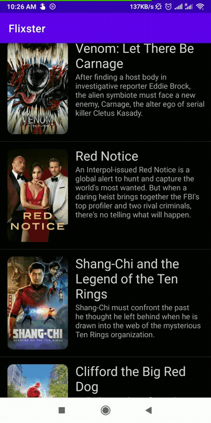

# *Flixster*

View a list of movies sourced from the The Movie Database API.

## User Stories

The following **required** functionality is completed:

* [X] User can view a list of movies (title, poster image, and overview) currently playing in theaters from the Movie Database API.
* [X] Expose details of movie (ratings using RatingBar, popularity, and synopsis) in a separate activity.
* [X] Allow video posts to be played in full-screen using the YouTubePlayerView

The following *additional** features are implemented:

* [X] Views should be responsive for both landscape/portrait mode.
* [X] A nice default placeholder graphic for each image during loading.
* [X] Improved the user interface through styling and coloring 
* [X] Added a rounded corners for the images using the Glide transformations
* [X] Trailers for popular movies are played automatically when the movie is selected

## Video Walkthrough

Here's a walkthrough of implemented user stories:



GIF created with [GIF Maker, GIF Editor](https://play.google.com/store/apps/details?id=com.media.zatashima.studio&hl=en_US&gl=US).

## Getting Started

### Clone the Repository

Get started by cloning the project to your local machine:

```
$ https://github.com/Rohit-Badugu/Flixster.git
```

## Prerequisites
1. Async HTTP client ```https://github.com/codepath/android_guides/wiki/Using-CodePath-Async-Http-Client```
2. Glide for loading images ```https://github.com/bumptech/glide```
3. RecycleView ```https://developer.android.com/jetpack/androidx/releases/recyclerview```
4. YoutubePlayerView ```https://guides.codepath.org/android/Streaming-Youtube-Videos-with-YouTubePlayerView```


## Android Version Targeting
Application is currently built to work with Android API 23(Marshmallow). 


## License

    Copyright [yyyy] [name of copyright owner]

    Licensed under the Apache License, Version 2.0 (the "License");
    you may not use this file except in compliance with the License.
    You may obtain a copy of the License at

        http://www.apache.org/licenses/LICENSE-2.0

    Unless required by applicable law or agreed to in writing, software
    distributed under the License is distributed on an "AS IS" BASIS,
    WITHOUT WARRANTIES OR CONDITIONS OF ANY KIND, either express or implied.
    See the License for the specific language governing permissions and
    limitations under the License.
